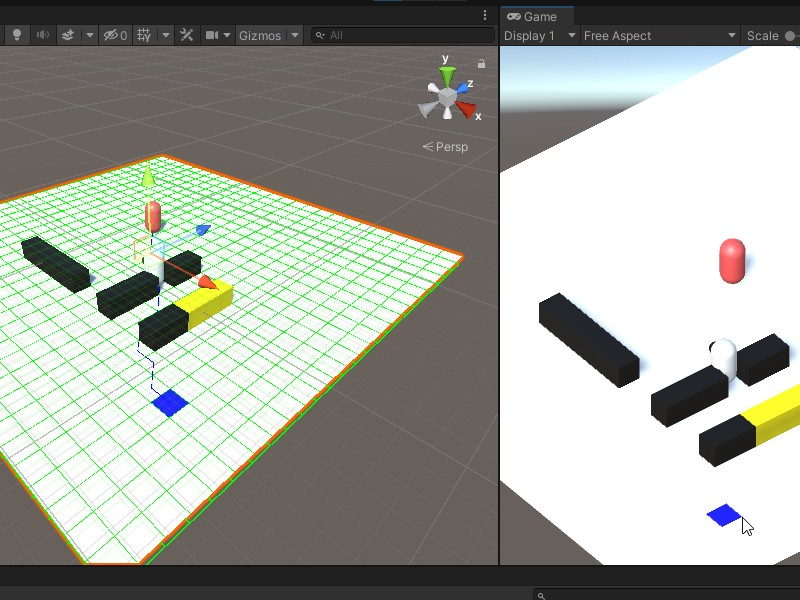
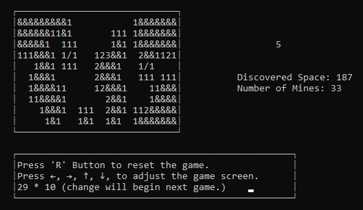
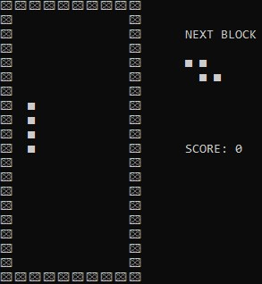

# What is this?
- 지금까지 한 대학교 과제, 연습 코드, 공부 내용 등을 기록한 것들입니다.
- 주로 C++와 관련된 내용이 있습니다.

# 목차
### 1. Coding_Test

- 코딩테스트 문제를 풀면서 기록한 코드들입니다.
- ct_가 붙어있는 코드는 프로그래머스 고득점 kit 문제들이며 나머지는 leetcode, 백준 등 여러 문제 사이트에 포함된 문제들입니다.
### 2. CppStudy

- 개인적으로 C++ 강의를 보며 기록한 코드들입니다.
### 3. GPP_Final

</img>

- 대학교 전공 과목 '게임프로그래밍패턴'의 기말 프로젝트입니다. Unity 프로젝트이며 C#으로 작성되었습니다.
- DFS, BFS, A* 알고리즘으로 길 찾기를 수행합니다.
- Command, Observer, Singleton 패턴을 조합하였습니다.
### 4. MineSweeper, Tetris

</img>
</img>

- 대학교 전공 과목의 프로젝트 중 하나로, 지뢰찾기와 테트리스를 C++로 구현하였습니다.
- WinAPI를 사용하여 커서와 키 입력을 받습니다.
- 지뢰찾기에서는 방향키로 게임 필드를 늘릴 수 있으며 깃발 꽂기 기능도 있습니다.
### 5. Modern_Design_Pattern

- Modern C++ 디자인 패턴입니다.
- 잘 알려진 Builder, Factory 외에 CRTP(Curiously Recurring Template Pattern: 이상한 재귀 템플릿 패턴), Mix in, RAII 패턴이 있습니다.
- 모 블로그를 참조하였습니다.
### 6. SplitPurchase

- C++로 만든 분할 매수 프로그램입니다.
- 파일 입출력과 관련된 코드를 주로 사용했으며 필요에 의해 개인적으로 만들었습니다.
### 7. pythonAI

- Python을 사용하여 기본적인 머신러닝과 딥러닝을 구현한 Pycharm 프로젝트입니다.
- 인터넷에서 쉽게 찾을 수 있는 데이터를 사용했으며, Clustering, Multi Classification, K-Fold Cross Validation 등의 내용이 있습니다.